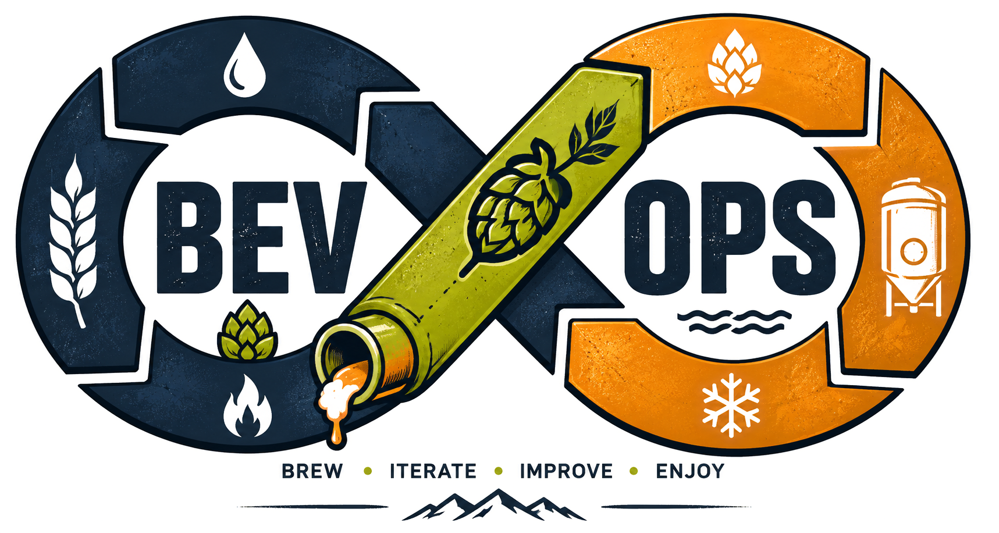

# BevOps Philosophy

*“BevOps applies DevOps principles to brewing to improve repeatability,
observability, and continuous improvement while preserving the
creativity and experimentation that make homebrewing enjoyable.”*

**Brew → Iterate → Improve → Enjoy**

The BevOps philosophy is relatively simple. Beer is brewed under a wide
range of conditions, so those conditions should be documented to allow
for explicit repeatability of any given batch of beer. Large breweries
even struggle with this to some degree. Maybe a batch of hops in a given
year are particularly more bitter than previously. Maybe switching
vendors for malt changed the flavor profile subtly but enough to notice.
BevOps captures those changes to a specific “version” of your beer to
the point where you can replicate it reliably.

The purpose of BevOps is not to eliminate creativity from brewing. The
purpose of BevOps is to document creativity so it can be repeated,
improved, and shared.

BevOps may not be for everyone but the philosophy is rooted in
structure, predictability, and reliability and can help any brewer make
the best beer they wish to make.

## Beer Development Life Cycle (BDLC)

Beer has a lifecycle, and so it stands to reason that beer development
has a lifecycle as well. BevOps seeks to incorporate the repeatability
and “deployment” of beer in the same manner that DevOps does so with
software.

But what are these cycles? Beer is as complex as software so let’s dig
into what this lifecycle looks like.

Ideation → Recipe Architecture → Development Brew → Testing & Validation → Deployment → Monitoring & Observability → Iteration

### Ideation

This is where beer takes root. It’s an idea. It’s drinking a beer and
thinking, “This would taste better with different hops”, or even “I
think I can make a better wit by adding a bit more coriander”. Ideation
is the playground of amazing beer and absolutely where your favorite
beer started.

### Recipe Architecture

Once you have an idea the next step is to formulate the recipe. What is
actually going to comprise this beer idea? Documenting your recipe is a
critical component to creating a specific batch of beer to a specific
set of expectations.

### Development Brew

Development Brew is the execution phase of the Beer Development Life
Cycle. During this stage the recipe architecture is transformed into a
physical batch of beer through mashing, boiling, fermentation, and
conditioning.

The goal of a Development Brew is not necessarily to produce a perfect
beer, but to generate a real-world implementation of the recipe design
that can be evaluated through Testing & Validation.

### Testing & Validation

Testing & Validation is the process of determining whether a beer
successfully met its intended design goals. While brewing and
fermentation produce the beer, testing & validation confirms whether the
resulting product aligns with the recipe specification, quality
objectives, and brewer expectations.

### Deployment

Deployment is the process of preparing and releasing a validated beer
for consumption. Once a batch has successfully completed Testing &
Validation, it enters Deployment where it is packaged, conditioned,
labeled, and made available for serving. This is transferring your
fermented, finished beer to bottles, kegs, growlers, or whatever you
intend to distribute to your audience.

### Monitoring & Observability

Monitoring & Observability is the practice of collecting, reviewing, and
analyzing brewing data throughout the lifecycle of a beer in order to
evaluate performance, identify trends, and inform future improvements.
That’s a fancy way of saying that you track feedback from people who
drink your beer (yes, even yourself!), demand for your beer, what its
shelf-life is, does it get better or worse over time, etc.

Monitoring focuses on tracking known metrics and conditions.
Observability expands upon monitoring by enabling brewers to understand
the relationships between those metrics and the resulting quality of the
finished beer.

The goal of Monitoring & Observability is not simply to collect data,
but to generate actionable insights that improve future batches.

Monitoring answers:

What happened?

Examples:

- Original Gravity was 1.052

- Final Gravity was 1.011

- Fermentation lasted 8 days

- Average fermentation temperature was 67°F

- Carbonation reached target levels

Observability answers:

Why did it happen?

Examples:

- Why did attenuation increase compared to the previous batch?

- Why did the beer finish drier than expected?

- Why did hop aroma fade more quickly than usual?

- Why was this batch clearer than previous releases?

### Iteration

Once you monitor and observe a batch, collect metrics, and determine the
final result, there is the choice to iterate on the batch. Ideally
iteration is improvement, or at minimum change. Perhaps feedback from
others was negative and you want to make improvements. Maybe you decide
to take a beer in a different direction. Any change from a specific
batch of beer should be viewed as an iteration.

Iteration is the heart of BDLC. Iteration is taking all of the other
BDLC concepts and learning from them. Beer evolves but iteration isn’t
even always about evolving. It’s about learning and adapting. Iteration
is about change.

Every batch, successful or otherwise, produces knowledge. BevOps treats
that knowledge as an asset to be documented, preserved, and applied to
future releases.

The goal of iteration is not perfection. The goal of iteration is
continuous improvement.

**Brew → Iterate → Improve → Enjoy**

## Semantic Fermentioning (SemFer)

Good brewers keep detailed brew logs for their batches to review like
baseball box scores. This data helps understand and improve the process
over time. In BevOps, recipe versions should be defined using semantic
versioning guidelines to help the brewer identify the batch and quickly
determine where it is in the Beer Development Life Cycle (BDLC). BevOps
defines this as “Semantic Fermentioning” or “SemFer”.

As noted previously , beer changes. That’s a natural given in brewing.
It’s rare that a beer stays 100% the same forever. That’s just a natural
evolution of the craft. BevOps factors that in by “versioning” batches
and carefully documenting what changed to allow for repeatability.
Imagine brewing a hefeweizen that you loved and then a year later
brewing a slightly different batch. Maybe you didn’t particularly care
for the new batch and really wanted to brew the original one you loved.
Traditionally you’d have to rely on detailed brew logs and memory but
with documented Semantic Fermentioning you can easily retrieve all of
the ingredients, brew steps, and nuances that made a specific batch
unique.

Guidelines for SemFer are as follows:

- v0.x.x = Experimental releases

- v1.0.0 = First approved production recipe

- v1.1.0 = Minor recipe refinement that intentionally affects flavor,
  aroma, body, or mouthfeel while preserving the beer's overall
  identity.

  - Example: Approved IPA recipe with adjustment in hop quantity or
    schedule

- v1.0.1 = Small operational “tweak” to recipe.

  - Example: Moved wort chilling from passive ice bath to continuous
    wort agitation during chilling

- v2.0.0 = Major recipe ingredient/profile change

  - Example: Changed hop variety or yeast type to directly impact
    overall beer flavor profile

Status Designations for batches should be as follows:

- Experimental

- Alpha

- Beta

- Stable

- LTS

- Deprecated

- Archived

Example:

> beer: Agave Drift
>
> version: 0.3.0
>
> status: Experimental

## Release Notes

One of the core BevOps principles is to keep release notes for versions
of beer. Similar to software, these release notes help identify what
changed to make the batch the version that is it. Release notes should
be clear and concise as to what changed if this is an iteration, or what
the batch is composed of if it is a new release.

Release notes should include the following at minimum:

- Summary

- Motivation

- Expected Outcome

Optionally:

- Observed Results

- Rollback Plan

Example:

> **Trailhead Wit v1.1.0**
>
> Summary: Increase coriander from 0.5 oz to 0.75 oz

> Motivation: Enhance citrus aroma

> Expected Outcome: More expressive nose

> Observed Results: Pending

## Service Level Indicators and Objectives (SLI/SLO)

### Pre-Boil Gravity

**Purpose:** Did the mash perform as expected before the boil?

*Example:*

### Original Gravity

**Purpose:** Did the mash and boil process produce the intended wort?

*Example:*

- Target: 1.065 ± 0.003

### Final Gravity

**Purpose:** Did fermentation complete successfully?

*Example:*

> 1.010–1.012

### Mash Efficiency

**Purpose:** How effectively sugars were extracted from the grain.

*Example:*

- Target: 72–78%

### Attenuation

**Purpose:** Fermentation affectiveness

*Example:*

> 75–80%

### Fermentation Duration

**Purpose:** Time to production readiness.

*Example:*

> 7-10 Days

### Temperature Stability

**Purpose:** Process consistency.

*Example:*

- Target: 66°F ±1°F

### Carbonation Accuracy

**Purpose:** Did packaging perform correctly?

*Example:*

> 2.5 vols CO₂

### Yield

**Purpose:** How much finished beer actually made it to packaging?

*Example:*

- 5 Gals Brewed

- 4.75 Gals packaged

### Packaging Loss

**Purpose:** Beer lost to trub, spills, transfer, samples

*Example:*

- Target: <10%

## Brewing Operations Reliability Assessment (BORA)

Operational frameworks like BevOps depend heavily on assessing the
reliability of it. Applying a framework like BevOps is pointless without
a way to determine if it’s working as expected.

In the same way that SLI and SLO metrics help track specifics of a batch
like gravity, clarity, attenuation, BORA establishes metrics to help
track the operational aspects of a batch.

### Deployment Frequency

**Purpose:** How often do you brew?

**Example:**

3 batches/month

---

### Lead Time for Changes

**Purpose:** How long from idea to product?

*Example:*

- Idea: May 1

- First Taste: June 1

Lead Time = 31 Days

---

### Change Failure Rate

**Purpose:** Percentage of recipe or process changes that produce an undesirable outcome.

*Examples:*

- Beer misses target profile

- Unexpected off-flavors

- Fermentation issues

- Carbonation problems

- Change did not achieve intended goal

### Mean Time To Recovery (MTTR)

**Purpose:** How long it takes to recover from a brewing incident.

*Examples:*

- Infection

- Stalled fermentation

- Broken equipment

- Failed recipe experiment

### Recipe Stability Index (RSI)

**Purpose:** How frequently a recipe changes. Helps to see which recipes are stable and which are still evolving.

*Example:*

Trailhead Wit:

- v1.0.0
- v1.1.0
- v1.2.0
- v1.2.1

4 changes in 12 months

### Rebrew Rate

**Purpose:** How often a recipe is brewed again.

*Example:*

El Pescador:
- Brewed: 6 times
- Rebrew Rate: High

### Operational Consistency Score

**Purpose:** How consistently you hit your targets,

*Example:*

- OG within target range
- FG within target range
- Fermentation temp maintained
- Packaging yield achieved

Target Metrics: 10
Met Metrics: 9
Consistency Score: 90%

### Documentation Coverage

**Purpose:** Percentage of batches that have complete documentation.

*Example:*

- Recipe
- Brew Log
- Release Notes
- Telemetry
- Batch Review

Batches Brewed: 20
Fully Documented: 18
Coverage: 90%

### Beer Satisfaction Score (BSS)

**Purpose:** Would I brew this again?

*Example:*

Scale: 1-5
1 = Never again
3 = Worth revisiting
5 = Immediate rebrew

## Incident Reports

Things can happen when brewing beer that you don’t intend that can have
a direct impact on the batch. These incidents should always be reported
and documented to help prevent them from happening again in the future.

*Example*:

Incident \#: BEV-2026-001

Summary: Tilt telemetry pipeline failed.

Impact: Lost 12 hours of fermentation data.

Root Cause: Brewer accidentally unplugged Tilt Pico while cleaning.

Resolution: Reconnected Pico.

Preventive Action: Do not unplug production monitoring systems while
drinking production monitoring outputs. 🍺

## Infrastructure Roadmap
_TODO: Planned for v0.2.0._

## Observability & Metrics
_TODO: Planned for v0.2.0._

## Glossary

**BDLC**

Beer Development Life Cycle

**BevOps**

Beverage Operations. Application of DevOps principles to brewing

**SemFer**

Semantic Fermentioning

**SLI**

Service Level Indicator

**SLO**

Service Level Objective

**BORA**

Brewing Operations Reliability Assessment
